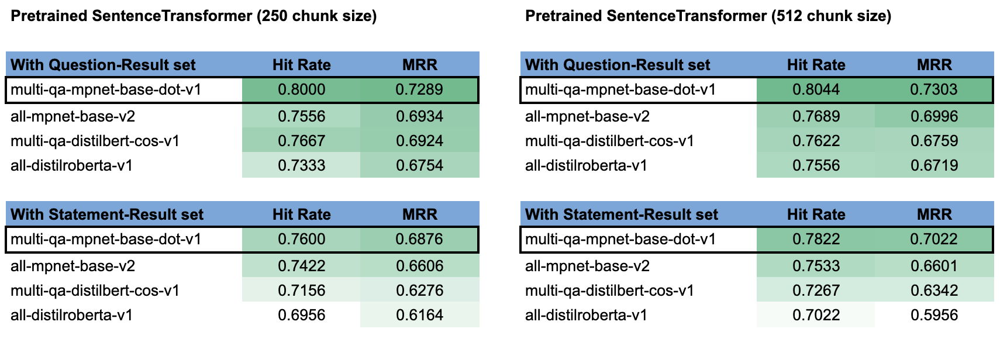
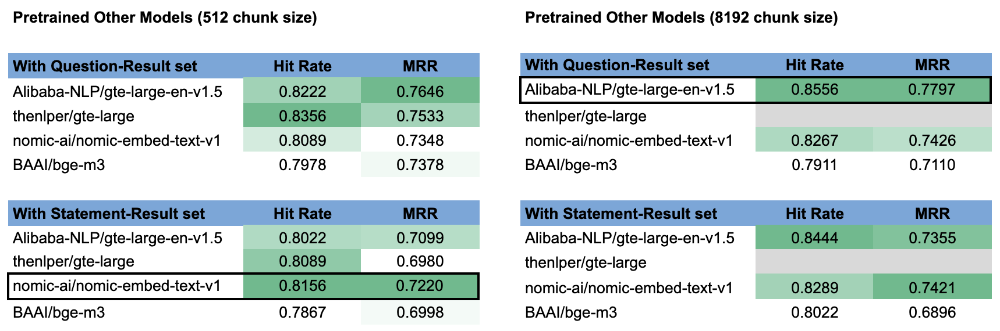

# CourtListener Semantic Search Documentation
As of February 2nd, 2025

## Goal
To implement semantic search functionality within CourtListener search functions, starting with Case Law (opinions). 

## Experimental Design
1. Identify existing products already in the market.
2. Identify state-of-the-art (SOTA) methods.
4. Extract a sample of the Case Law data for experiments, perform cleaning and assign label as needed for training, finetuning, and/or evaluation.
5. Use the sample dataset to experiment with various solutions.
6. Identify the best solution for CourtListener, balancing performance (evaluation metrics), cost (monetary and compute), reliability, and ease of use.

## Terminology
1. **Query**: what the user inputs in the search bar, can be questions or statements.
2. **Result**: what the model retrieves based on the query, in Case Law, these would be the opinions.
3. **Two-Tower Model** / Dual-Encoder / Bi-Encoder Model: A common model designed to perform semantic search, where the query and the result are feed into the model as pairs for the model to learn the semantic similarities between the queries and the results. Notabily, the model has two encoder with one overall objective function.
4. **RAG**: Retrieval Augmented Generation. Differ from generic retrieval which can be achieved via only an encoder model, RAG requires a decoder model to "generate". The "retrieval" is used to improve accuracy and reduce hallucination of the generated text.

## Existing Products/Solutions

#### Standalone semantic based search engine:
   1. [Parallel Search by casetext (Part of Thomson Reuters)](https://parallelsearch.casetext.com/)
      - They have a [blog](https://casetext.com/blog/machine-learning-behind-parallel-search) that talks about their methodology, TLDR is a **generic two-tower model with reranking**.
      - Mechanism: User enters a **statement**, the model looks for **opinions** that have similar meanings as the **statement**, **cases** are looked up & shown to the user based on the matched **opinions**.
      - Filter: by Federal vs State jurisdictions
      - Method: A classic two-tower information-retrieval model finetuned (with labelled sentence pairs where similar sentences are 1, dissimilar sentences are 0) on top of a base model (pre-trained on the entire body of US judicial opinions), uses nearest-neigbor for efficient retrieval with another finetuned (with labelled sentence pairs with ranks) rerank model to improve the retrieved results.
   2. [SmartCounsel.AI](https://smartcounsel.ai/)
      - Not much information can be found on their methodology or their tools, but [supposely](https://product.smartcounsel.ai/post/how-ai-is-transforming-legal-research-and-discovery) they offer a semantic search engine similar to casetext.
   3. [Bloomberg Law](https://pro.bloomberglaw.com/products/legal-research-and-software/legal-research/)
   4. [LexisNexis](https://www.lexisnexis.com/en-us/case-law-research/)
   5. [Westlaw Egde](https://legal.thomsonreuters.com/en/products/westlaw-edge)
      - Not much information can be found on their methodology or their tools, but the short video demo shows the tool bar auto generates **questions** based on user's keywords, and the tool looks up **cases** to accompany the **AI-generated summarized answer** to the question. More of a RAG system than pure search engine.
        
#### Semantic search embedded as part of RAG. 
RAG systems are built for "conversational" interactions, so the query is often formulated as a question.
   1. [Westlaw Precision with CoCounsel]((https://legal.thomsonreuters.com/en/c/westlaw/westlaw-precision-generative-ai))
   2. [Lexis + AI](https://www.lexisnexis.com/en-us/products/lexis-plus-ai.page)
   3. [vincent-ai (part of vLex)](https://vlex.com/vincent-ai)
   4. [servient](https://www.servient.com/)
   5. [alexi](https://www.alexi.com/)
   6. [paxton.ai](https://www.paxton.ai/legal-research)

#### Other common research tools currently not offering semantic search.
   1. [Fastcase](https://www.fastcase.com/)
   2. [Law.com](http://dictionary.law.com/Default.aspx)
   3. [Wex](https://www.law.cornell.edu/search/wex)
   4. [Google Scholar](https://scholar.google.com/)
 
## SOTA Methods
- Latest academic publications (TLDR: not much ground-breaking research in the area recently, most research still in-use today are from a couple years ago.):
   - [ACL Anthology](https://aclanthology.org/events/acl-2024/)
      - [Legal Case Retrieval: A Survey of the State of the Art](https://aclanthology.org/2024.acl-long.350/): more of a survey with China-centered data & research, not super applicable to US-centered tasks.
      - [An Element is Worth a Thousand Words: Enhancing Legal Case Retrieval by Incorporating Legal Elements](https://aclanthology.org/2024.findings-acl.139/): again, a more China-centered research, but the model architecture is transferrable, the key idea is to integrate Named Entity Recognition (NER) into the retrieval task, also important to mask the person/place etc to make the texts more generalizable. Key learnings: 1) long context window doesn't work well, and 2) BM25 is still a very strong ranking algorithm.
      - [Measuring the Groundedness of Legal Question-Answering Systems](https://aclanthology.org/2024.nllp-1.14/): focused on generative tasks (vs traditional retrieval), but the some of the set-up is transferrable, one idea is to generate ground-truth by using one model to generate query-response pairs and then use another model to evaluate the semantic similarity to select the "golden" standards.
   - [Its All Relative! -- A Synthetic Query Generation Approach for Improving Zero-Shot Relevance Prediction](https://research.google/pubs/its-all-relative-a-synthetic-query-generation-approach-for-improving-zero-shot-relevance-prediction/)
- Base models (require fine-tuning):
   - [ModernBERT](https://huggingface.co/blog/modernbert)
   - [ColBERT](https://huggingface.co/colbert-ir/colbertv2.0)
- Information Retrieval models:
   - [SentenceTransformer](https://huggingface.co/sentence-transformers)
   - [Voyage AI](https://blog.voyageai.com/2024/04/15/domain-specific-embeddings-and-retrieval-legal-edition-voyage-law-2/)
   - [OpenAI Vector Embeddings](https://platform.openai.com/docs/guides/embeddings)
- Evaluation:
   - [Evaluation Metrics for Recommender Systems](https://towardsdatascience.com/ranking-evaluation-metrics-for-recommender-systems-263d0a66ef54)
   - [Massive Text Embeddings Benchmark (MTEB)](https://huggingface.co/spaces/mteb/leaderboard)

## Methods & Dataset Curation
Given this is a fairly open-ended task, we have two options for problem formation: 
1) a question-answering (QA) based retrieval task, or
2) an information based (IR) retrieval task.

These are similar tasks in nature but has some fundamental differences. Most notably, they require different models specifically finetuned to perform either QA or IR. An overly simplified example is: a model trained to do QA would map "What is your name?" - "My name is John" closer to each other, whereas a model trained to do IR would map "What is your name?" - "Tell me your name" closer to each other and "My name is John" - "I am James" closer to each other. 

Previous experiments focused primarily on a QA task formation, here I will also experiment with an IR task formation. 

### Data
Given we do not current have a set of "golden" standards of query-result pairs (in either QA or IR format) for finetuning or evaluation, we will generate synthetic data using the opinions we have in Case Law (ie, we already have the results but need the queries). 

For both QA and IR tasks, I decided to use an LLM to generate the relevant and irrelevant queries associated with the results, and use another LLM to evaluate the generated queries and the results and filter for only the query-result pairs above a threshold, this filtered result will serve as our "golden" standards for evaluation. This approach is largely inspired by [this Google paper](https://research.google/pubs/its-all-relative-a-synthetic-query-generation-approach-for-improving-zero-shot-relevance-prediction/), however, given the scope of this project, I directly used LLMs out-of-the-box. (also see limitations and future works)

Furthermore, previous experiments focused primarily on (Supreme Court of the United States) SCOTUS opinions, because they are well reasoned, well organized, and well documented. Our database indeed has a large corpus of SCOTUS opinions, however, there are also opinions from many other courts, with a very long tail of courts that only has a handful of opinions. To test the robustness of the model against our corpus, and to reduce the gap between experimental and production performance, I selected opinions from a wide range of courts, closely adhering to the population distribution, for this round of experiments.

Steps:
1. Sample opinions from the Development Database (also see limitations and future works)
   - **Notebook path**: /notebooks_&\_data/0.opinion_stats_&_sampling.ipynb
   - **Stats**: 953 opinions selected (\~1% of 9.7M opinions), covering 184 courts (~8% of 2K courts), with the top 20 courts (including SCOTUS) covering ~50% of sampled opinions. The sample distribution is visually compared against the population distribution to ensure they are similar.
2. Preprocess & clean the opinions
   - **Notebook path**: /notebooks_&\_data/1a.preprocess_columns.ipynb
      - To clean up the columns after the SQL join
   - **Notebook path**: /notebooks_&\_data/1b.preprocess_opinions.ipynb
      - To clean up the opinions from different sources and create one opinion column
3. Feed the cleaned opinions to an LLM to generate queries
   - **Notebook path**: /notebooks_&\_data/2a.generate_queries.ipynb
      - After reading through some of the existing tools to generate synthetic IR datasets, I decided to use gpt-4o-mini as the LLM to generate the queries based on 1) the API is easy to use, 2) the model performance is comparable to that of 4o at a fraction of the cost, 3) OpenAI's models are still considered SOTA for many use cases, has very long context windows, and has robust language understanding and legal knowledge.
      - To reduce the number of requests sent through the API, I batched the opinions to batches. I also asked the model to generate both relevant and irrelevant queries in one request, and the prompt was tuned through experiments on small batches.
   - **Notebook path**: /notebooks_&\_data/2b.generate_questions.ipynb
      - Previous experiments used [llamaindex](https://docs.llamaindex.ai/en/stable/examples/finetuning/embeddings/finetune_embedding_adapter/#generate-synthetic-queries)'s native support of generating QA embeddings through GPT models. Here, I directly used gpt-4o-mini through its API and had the model generate both relevant and irrelevant questions, the prompt was also tuned through experiments on small batches.
4. Review the generated queries and the source opinion to ensure quality by comparing cosine similarities
   - **Notebook path**: /notebooks_&\_data/3a.check_similarities.ipynb
      - [TF-IDF is still a strong baseline](https://research.google/pubs/its-all-relative-a-synthetic-query-generation-approach-for-improving-zero-shot-relevance-prediction/) for retrieval evaluation, so I used TF-IDF as the first pass to calculate the cosine similarities between the queries and the results, with the expectation that the cosine similarity from the relevant query should be higher than that of the irrelevant query.
      - If there are any instances where the similarity score from irrelevant query is above that of the relevant query, use legal-bert to check. One main limitation of legal-bert is the short context window size of 512, for this exercise, I simply truncated the opinions to at most 512 tokens, but it is possible the most relevant passage resides past the 512th token in the opinion.
      - To the extent there are still any instances where the similarity score from irrelevant query is above that of the relevant query, randomly sample 5 opinions for manual review.
      - Based on TF-IDF and legal-bert similarity scores and my (not a legal professional) review of the sampled opinions, the synthetically generated data is "reasonably" good for the task at hand.
   - **Notebook path**: /notebooks_&\_data/3b.combine_datasets.ipynb
      - To combine the dataset and split the data to train vs test sets.
      - Given we do not plan to train a model from scratch and need a smaller set of datapoints for finetuning, and we most likely plan to use an out-the-box model without finetuning, I did a ~55/45 split.
5. EDA
   - TO BE COMPLETED!!!

### Model & Evaluation
Adhering to our mission statement and the open source nature of our work, we narrowed our model selection to only open source models and models that are not overly large such that it can be used on a large corpus without exessive compute. Furthermore, we believe an open source models that doesn't require an external API may be more secure and better suited for our platform given privacy concerns. Therefore, SOTA models such as OpenAI, Mistral, Voyage AI etc are not considered in our experiments.

1. Previous experiments
   - Previous experiments were conducted on 10 SCOTUS cases across 5 models: [adlumal/auslaw-embed-v1.0](https://huggingface.co/adlumal/auslaw-embed-v1.0), [BAAI/bge-large-en-v1.5](https://huggingface.co/BAAI/bge-large-en-v1.5), [sentence-transformers/all-MiniLM-L6-v2](https://huggingface.co/sentence-transformers/all-MiniLM-L6-v2), [WhereIsAI/UAE-Large-V1](https://huggingface.co/WhereIsAI/UAE-Large-V1), and [sentence-transformers/multi-qa-mpnet-base-dot-v1](https://huggingface.co/sentence-transformers/multi-qa-mpnet-base-dot-v1), with `multi-qa-mpnet-base-dot-v1` having the best performance. 
2. Pretrained SentenceTransformer
   - Building on top of previous experiments, I began with a few more pretrained SentenceTransformer models, including `multi-qa-mpnet-base-dot-v1`, to confirm `multi-qa-mpnet-base-dot-v1` is the best pretrained SentenceTransformer model. The models are selected based on the [SentenceTransformer performance board](https://www.sbert.net/docs/sentence_transformer/pretrained_models.html). I began with a chunk size of 250 given the documentation "Further note that the model was just trained on input text up to 250 word pieces. It might not work well for longer text.", however, from the experiment, we see the model performed better with a 512 context size.
   - The models experimented are: [multi-qa-mpnet-base-dot-v1](https://huggingface.co/sentence-transformers/multi-qa-mpnet-base-dot-v1), [all-mpnet-base-v2](https://huggingface.co/sentence-transformers/all-mpnet-base-v2), [multi-qa-distilbert-cos-v1](https://huggingface.co/sentence-transformers/multi-qa-distilbert-cos-v1), and [all-distilroberta-v1](https://huggingface.co/sentence-transformers/all-distilroberta-v1).
   - Overall, `multi-qa-mpnet-base-dot-v1` performed the best amongst the four models, in both QA and IR task formation, and the longer context size of 512 improved the performance for all models. Note that this also means if the user were to input a statement vs a question, we would expect a slight performance dip.
   - 
3. Other existing pretrained open source solutions
   - In addition to pretrained models native to SentenceTransformer, there are also many other models with SentenceTransformer integration for inference. I selected the models based on the MTEB board on HuggingFace as well as the [most downloaded models from HuggingFace Models for sentence similarity](https://huggingface.co/models?pipeline_tag=sentence-similarity&sort=downloads). In addition to the below models, I initially also selected [Alibaba-NLP/gte-Qwen2-7B-instruct](https://huggingface.co/Alibaba-NLP/gte-Qwen2-7B-instruct) for experiments, however, this model requires too much GPU memory (>15GB), so it is not practical for our use case. I began with a context size of 512, which is a commonly used chunk size for language models, however, a few of the models also supported long context windows of up to 8192 context size, so I also experimented with long context size.
   - The models experimented are: [Alibaba-NLP/gte-large-en-v1.5](https://huggingface.co/Alibaba-NLP/gte-large-en-v1.5), [thenlper/gte-large](https://huggingface.co/thenlper/gte-large), [nomic-ai/nomic-embed-text-v1](https://huggingface.co/nomic-ai/nomic-embed-text-v1.5), and [BAAI/bge-m3](https://huggingface.co/BAAI/bge-m3). [thenlper/gte-large](https://huggingface.co/thenlper/gte-large) is the only model that did not support long context window.
   - Overall, `Alibaba-NLP/gte-large-en-v1.5` performed the best amongst the four models, in both QA and IR task formation, with `nomic-ai/nomic-embed-text-v1` as a close second with a much smaller model size. Contrary to previous experiments, we see here that the longer context window (if supported by the model) provided a sizable jump in the performance. Again, we see that the models perform slightly better with a QA set-up, meaning if the user were to input a statement vs a question, we would expect a slight performance dip (except for `nomic-ai/nomic-embed-text-v1`, where an IR set-up proves to have better performance).
   - 
     

### Limitation & Future Works