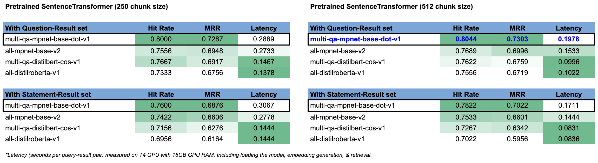
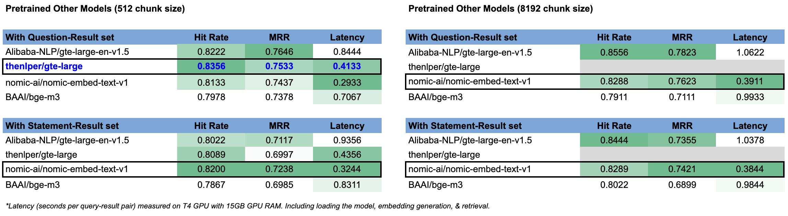
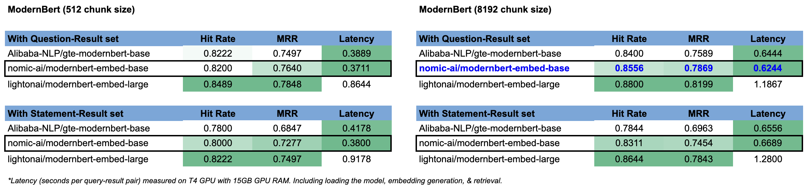
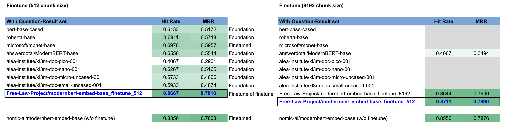

# CourtListener Semantic Search Documentation
As of March 5th, 2025

## Foreword
This project is the result of community effort within the Free Law Project and the broader legal community, see [GitHub ticket](https://github.com/freelawproject/courtlistener/issues/4962) for discussions and previous experiments.

## Goal
To implement semantic search functionality within CourtListener search functions, starting with Case Law (opinions). 

This is a continuation of previous experiments conducted, listed below are some key difference against previous experiments:
| Previous Experiments | This Experiments | 
|----------|----------|
| Compared performance with both open source & closed source models/tools  | Focus on only open source models/tools  |
| Used 10 SCOTUS cases as experimental dataset  | Sample ~1K cases across different courts from population to evaluate robustness |
| Focused on QA task formation  | Experiment with both QA and IR task formation |

## Experimental Design
1. Identify existing products already in the market.
2. Identify state-of-the-art (SOTA) methods.
3. Extract a sample of the Case Law data for experiments, perform cleaning and assign label as needed for training, finetuning, and/or evaluation.
4. Use the sample dataset to experiment with various solutions.
5. Identify the best solution for CourtListener, balancing performance (evaluation metrics), cost (monetary and compute), reliability, and ease of use.

## Terminology
1. **Query**: what the user inputs in the search bar, can be questions or statements.
2. **Result**: what the model retrieves based on the query, in Case Law, these would be the opinions.
3. **Two-Tower Model** / Dual-Encoder / Bi-Encoder Model: A common model designed to perform semantic search, where the query and the result are feed into the model as pairs for the model to learn the semantic similarities between the queries and the results. Notabily, the model has two encoder with one overall objective function.
4. **RAG**: Retrieval Augmented Generation. Differ from generic retrieval which can be achieved via only an encoder model, RAG requires a decoder model to "generate". The "retrieval" is used to improve accuracy and reduce hallucination of the generated text.

## Existing Products/Solutions

#### Standalone semantic based search engine:
   1. [Parallel Search by casetext (Part of Thomson Reuters)](https://parallelsearch.casetext.com/)
      - They have a [blog](https://casetext.com/blog/machine-learning-behind-parallel-search) that talks about their methodology, TLDR is a **generic two-tower model with reranking**.
      - Mechanism: User enters a **statement**, the model looks for **opinions** that have similar meanings as the **statement**, **cases** are looked up & shown to the user based on the matched **opinions**.
      - Filter: by Federal vs State jurisdictions
      - Method: A classic two-tower information-retrieval model finetuned (with labelled sentence pairs where similar sentences are 1, dissimilar sentences are 0) on top of a base model (pre-trained on the entire body of US judicial opinions), uses nearest-neigbor for efficient retrieval with another finetuned (with labelled sentence pairs with ranks) rerank model to improve the retrieved results.
   2. [SmartCounsel.AI](https://smartcounsel.ai/)
      - Not much information can be found on their methodology or their tools, but [supposely](https://product.smartcounsel.ai/post/how-ai-is-transforming-legal-research-and-discovery) they offer a semantic search engine similar to casetext.
   3. [Bloomberg Law](https://pro.bloomberglaw.com/products/legal-research-and-software/legal-research/)
   4. [LexisNexis](https://www.lexisnexis.com/en-us/case-law-research/)
   5. [Westlaw Egde](https://legal.thomsonreuters.com/en/products/westlaw-edge)
      - Not much information can be found on their methodology or their tools, but the short video demo shows the tool bar auto generates **questions** based on user's keywords, and the tool looks up **cases** to accompany the **AI-generated summarized answer** to the question. More of a RAG system than pure search engine.
        
#### Semantic search embedded as part of RAG. 
RAG systems are built for "conversational" interactions, so the query is often formulated as a question.
   1. [Westlaw Precision with CoCounsel](https://legal.thomsonreuters.com/en/c/westlaw/westlaw-precision-generative-ai)
   2. [Lexis + AI](https://www.lexisnexis.com/en-us/products/lexis-plus-ai.page)
   3. [vincent-ai (part of vLex)](https://vlex.com/vincent-ai)
   4. [servient](https://www.servient.com/)
   5. [alexi](https://www.alexi.com/)
   6. [paxton.ai](https://www.paxton.ai/legal-research)

#### Other common research tools currently not offering semantic search.
   1. [Fastcase](https://www.fastcase.com/)
   2. [Law.com](http://dictionary.law.com/Default.aspx)
   3. [Wex](https://www.law.cornell.edu/search/wex)
   4. [Google Scholar](https://scholar.google.com/)
 
## SOTA Methods
- Latest academic publications (TLDR: not much ground-breaking research in the area recently, most research still in-use today are from a couple years ago.):
   - [ACL Anthology](https://aclanthology.org/events/acl-2024/)
      - [Legal Case Retrieval: A Survey of the State of the Art](https://aclanthology.org/2024.acl-long.350/): more of a survey with China-centered data & research, not super applicable to US-centered tasks.
      - [An Element is Worth a Thousand Words: Enhancing Legal Case Retrieval by Incorporating Legal Elements](https://aclanthology.org/2024.findings-acl.139/): again, a more China-centered research, but the model architecture is transferrable, the key idea is to integrate Named Entity Recognition (NER) into the retrieval task, also important to mask the person/place etc to make the texts more generalizable. Key learnings: 1) long context window doesn't work well, and 2) BM25 is still a very strong ranking algorithm.
      - [Measuring the Groundedness of Legal Question-Answering Systems](https://aclanthology.org/2024.nllp-1.14/): focused on generative tasks (vs traditional retrieval), but the some of the set-up is transferrable, one idea is to generate ground-truth by using one model to generate query-response pairs and then use another model to evaluate the semantic similarity to select the "golden" standards.
   - [Its All Relative! -- A Synthetic Query Generation Approach for Improving Zero-Shot Relevance Prediction](https://research.google/pubs/its-all-relative-a-synthetic-query-generation-approach-for-improving-zero-shot-relevance-prediction/): a number of ideas and findings could be useful for this project, including methods to generate synthetic dataset and model selection. 
- Base models (require fine-tuning):
   - [ModernBERT](https://huggingface.co/blog/modernbert)
   - [ColBERT](https://huggingface.co/colbert-ir/colbertv2.0)
- Information Retrieval models:
   - [SentenceTransformer](https://huggingface.co/sentence-transformers)
   - [Voyage AI](https://blog.voyageai.com/2024/04/15/domain-specific-embeddings-and-retrieval-legal-edition-voyage-law-2/)
   - [OpenAI Vector Embeddings](https://platform.openai.com/docs/guides/embeddings)
- Evaluation:
   - [Evaluation Metrics for Recommender Systems](https://towardsdatascience.com/ranking-evaluation-metrics-for-recommender-systems-263d0a66ef54)
   - [Massive Text Embeddings Benchmark (MTEB)](https://huggingface.co/spaces/mteb/leaderboard)

## Methods & Dataset Curation
Given this is a fairly open-ended task, we have two options for problem formation: 
1) a question-answering (QA) based retrieval task, or
2) an information based (IR) retrieval task.

These are similar tasks in nature but has some fundamental differences. Most notably, they require different models specifically finetuned to perform either QA or IR. An overly simplified example is: a model trained to do QA would map "What is your name?" - "My name is John" closer to each other, whereas a model trained to do IR would map "What is your name?" - "Tell me your name" closer to each other and "My name is John" - "I am James" closer to each other. 

Previous experiments focused primarily on a QA task formation, here I will also experiment with an IR task formation. 

### Data
Given we do not current have a set of "golden" standards of query-result pairs (in either QA or IR format) for finetuning or evaluation, we will generate synthetic data using the opinions we have in Case Law (ie, we already have the results but need the queries). 

For both QA and IR tasks, I decided to use an LLM to generate the relevant and irrelevant queries associated with the results, and use another LLM to evaluate the generated queries and the results and filter for only the query-result pairs above a threshold, this filtered result will serve as our "golden" standards for evaluation. This approach is largely inspired by [this Google paper](https://research.google/pubs/its-all-relative-a-synthetic-query-generation-approach-for-improving-zero-shot-relevance-prediction/), given the scope of this project, I directly used LLMs out-of-the-box.

Furthermore, previous experiments focused primarily on (Supreme Court of the United States) SCOTUS opinions, because they are well reasoned, well organized, and well documented. Our database indeed has a large corpus of SCOTUS opinions, however, there are also opinions from many other courts, with a very long tail of courts that only has a handful of opinions. To test the robustness of the model against our corpus and to reduce the gap between experimental and production performance, I selected opinions from a wide range of courts and of varying length, closely adhering to the population distribution, for this round of experiments.

Steps:
1. Sample opinions from the Development Database
   - **Notebook path**: /notebooks_&\_data/0.opinion_stats_&_sampling.ipynb
   - **Stats**: 953 opinions selected (\~0.01% of 9.7M opinions), covering 184 courts (~8% of 2K courts), with the top 20 courts (including SCOTUS) covering ~50% of sampled opinions. The sample distribution is visually compared against the population distribution to ensure they are similar.
2. Preprocess & clean the opinions
   - **Notebook path**: /notebooks_&\_data/1a.preprocess_columns.ipynb
      - To clean up the columns after the SQL join
   - **Notebook path**: /notebooks_&\_data/1b.preprocess_opinions.ipynb
      - To clean up the opinions from different sources and create one opinion column
3. Feed the cleaned opinions to an LLM to generate queries
   - **Notebook path**: /notebooks_&\_data/2a.generate_queries.ipynb
      - After reading through some of the existing tools to generate synthetic IR datasets, I decided to use gpt-4o-mini as the LLM to generate the queries based on 1) the API is easy to use, 2) the model performance is comparable to that of 4o at a fraction of the cost, 3) OpenAI's models are still considered SOTA for many use cases, has very long context windows, and has robust language understanding and legal knowledge. 
      - To reduce the number of requests sent through the API, I batched the opinions to batches. I also asked the model to generate both relevant and irrelevant queries in one request, and the prompt was tuned through experiments on small batches.
   - **Notebook path**: /notebooks_&\_data/2b.generate_questions.ipynb
      - Previous experiments used [llamaindex](https://docs.llamaindex.ai/en/stable/examples/finetuning/embeddings/finetune_embedding_adapter/#generate-synthetic-queries)'s native support of generating QA embeddings through GPT models. Here, I directly used gpt-4o-mini through its API and had the model generate both relevant and irrelevant questions, the prompt was also tuned through experiments on small batches.
4. Review the generated queries and the source opinion to ensure quality by comparing cosine similarities
   - **Notebook path**: /notebooks_&\_data/3a.check_similarities.ipynb
      - [TF-IDF is still a strong baseline](https://research.google/pubs/its-all-relative-a-synthetic-query-generation-approach-for-improving-zero-shot-relevance-prediction/) for retrieval evaluation, so I used TF-IDF as the first pass to calculate the cosine similarities between the queries and the results, with the expectation that the cosine similarity from the relevant query should be higher than that of the irrelevant query.
      - If there are any instances where the similarity score from irrelevant query is above that of the relevant query, use legal-bert to check. One main limitation of legal-bert is the short context window size of 512, for this exercise, I simply truncated the opinions to at most 512 tokens, but it is possible the most relevant passage resides past the 512th token in the opinion.
      - To the extent there are still any instances where the similarity score from irrelevant query is above that of the relevant query, randomly sample 5 opinions for manual review.
      - Based on TF-IDF and legal-bert similarity scores and my (not a legal professional) review of the sampled opinions, the synthetically generated data is "reasonably" good for the task at hand.
   - **Notebook path**: /notebooks_&\_data/3b.combine_datasets.ipynb
      - To combine the dataset and split the data to train vs test sets.
      - Given we do not plan to train a model from scratch and need a smaller set of datapoints for finetuning, and we most likely plan to use an out-the-box model without finetuning, I did a ~55/45 split.

### Model & Evaluation
Adhering to our mission statement and the open source nature of our work, we narrowed our model selection to only open source models and models that are not overly large such that it can be used on a large corpus without exessive compute. Furthermore, we believe an open source models that doesn't require an external API may be more secure and better suited for our platform given privacy concerns. Therefore, SOTA models such as OpenAI, Mistral, Voyage AI etc are not considered in our experiments.
- **Notebook path**: /notebooks_&\_data/4...series
  
1. Previous experiments
   - Previous experiments were conducted on 10 SCOTUS cases across 5 models: [adlumal/auslaw-embed-v1.0](https://huggingface.co/adlumal/auslaw-embed-v1.0), [BAAI/bge-large-en-v1.5](https://huggingface.co/BAAI/bge-large-en-v1.5), [sentence-transformers/all-MiniLM-L6-v2](https://huggingface.co/sentence-transformers/all-MiniLM-L6-v2), [WhereIsAI/UAE-Large-V1](https://huggingface.co/WhereIsAI/UAE-Large-V1), and [sentence-transformers/multi-qa-mpnet-base-dot-v1](https://huggingface.co/sentence-transformers/multi-qa-mpnet-base-dot-v1), with `multi-qa-mpnet-base-dot-v1` having the best performance.
   - Previous experiments used Hit Rate and MRR as the evaluation metrics. Given we are not performing reranking at this stage, I will also use the same evaluation metrics for the experiments.
2. Pretrained SentenceTransformer
   - Building on top of previous experiments, I began with a few more pretrained SentenceTransformer models, including `multi-qa-mpnet-base-dot-v1`, to confirm `multi-qa-mpnet-base-dot-v1` is the best pretrained SentenceTransformer model. The models are selected based on the [SentenceTransformer performance board](https://www.sbert.net/docs/sentence_transformer/pretrained_models.html). I began with a chunk size of 250 given the documentation "Further note that the model was just trained on input text up to 250 word pieces. It might not work well for longer text.", however, from the experiment, we see the models performed better with a 512 context size.
   - The models experimented are: [multi-qa-mpnet-base-dot-v1](https://huggingface.co/sentence-transformers/multi-qa-mpnet-base-dot-v1), [all-mpnet-base-v2](https://huggingface.co/sentence-transformers/all-mpnet-base-v2), [multi-qa-distilbert-cos-v1](https://huggingface.co/sentence-transformers/multi-qa-distilbert-cos-v1), and [all-distilroberta-v1](https://huggingface.co/sentence-transformers/all-distilroberta-v1).
   - Overall, `multi-qa-mpnet-base-dot-v1` performed the best amongst the four models, in both QA and IR task formation, and the longer context size of 512 improved the performance for all models. Note that this also means if the user were to input a statement vs a question, we would expect a slight performance dip. The latency of `multi-qa-mpnet-base-dot-v1` is also pretty reasonable, so `multi-qa-mpnet-base-dot-v1` is the winner in this round of experiments.
   - 
3. Other existing pretrained open source solutions
   - In addition to pretrained models native to SentenceTransformer, there are also many other models with SentenceTransformer integration for inference. I selected the models based on the MTEB board on HuggingFace as well as the [most downloaded models from HuggingFace Models for sentence similarity](https://huggingface.co/models?pipeline_tag=sentence-similarity&sort=downloads). In addition to the below models, I initially also selected [Alibaba-NLP/gte-Qwen2-7B-instruct](https://huggingface.co/Alibaba-NLP/gte-Qwen2-7B-instruct) for experiments, however, this model required too much GPU memory (>15GB), so it is not practical for our use case. I began with a context size of 512, which is a commonly used chunk size for language models, however, a few of the models also supported long context windows of up to 8192 context size, so I also experimented with long context size.
   - The models experimented are: [Alibaba-NLP/gte-large-en-v1.5](https://huggingface.co/Alibaba-NLP/gte-large-en-v1.5), [thenlper/gte-large](https://huggingface.co/thenlper/gte-large), [nomic-ai/nomic-embed-text-v1](https://huggingface.co/nomic-ai/nomic-embed-text-v1.5), and [BAAI/bge-m3](https://huggingface.co/BAAI/bge-m3). [thenlper/gte-large](https://huggingface.co/thenlper/gte-large) is the only model that did not support long context window.
   - Overall, balancing performance and latency, `thenlper/gte-large` performed the best with 512 chunk size with `nomic-ai/nomic-embed-text-v1` being the runner up and the best model with 8192 chunk size. For the models that support long context, providing long context opinions improved the performance. This is likely due to long context captures more robust semantics with long range references. Think about reading a paper, the texts in the middle of the paragraph often refers to facts mentioned earlier in the paper, if the earlier mentioned fact is not in the current chunk, the semantics associated with these important facts are now missing. 
   - 
4. Pretrained open source solutions finetuned on top of ModernBERT
   - [ModernBert](https://huggingface.co/blog/modernbert) was released earlier this year and showed significant improvements over previous BERT-family models. In addition, ModernBERT provides capabilities of long contexts, which could be particularly useful for legal opinions. Therefore, I also experimented with a few models that have been finetuned on top of ModernBERT.
   - The models experimented are: [Alibaba-NLP/gte-modernbert-base](https://huggingface.co/Alibaba-NLP/gte-modernbert-base), [nomic-ai/modernbert-embed-base](https://huggingface.co/nomic-ai/modernbert-embed-base), and [lightonai/modernbert-embed-large](https://huggingface.co/lightonai/modernbert-embed-large). Since ModernBERT has only been released for a month, there aren't that many options yet, but given the model capabilities, we should expect more models to come out in the coming year.
   - Overall, balancing performance and latency, `nomic-ai/modernbert-embed-base` is the unchallenged winner in both 512 chunk size and 8192 chunk size for both QA and IR task formation. Even though `lightonai/modernbert-embed-large` had better performance, due to the model size, the performance-latency trade-off is too great for it to be beneficial for production use case. Consistent with the other experiments, larger chunk sizes improves the performance. `nomic-ai/modernbert-embed-base` with 8192 chunk size and in a QA task formation had the best performance amongst all experiments.
   - 

NOTE: the latency shown in the images are for encoding both the query and context in real-time. In production, the context would be encoded in advance, and we would have multiple clusters managing the workload, therefore, the latency would be at a fraction of what's shown.

### Conclusion
Given the experimental results above, the two models I recommend are:
1. `multi-qa-mpnet-base-dot-v1` with 512 chunk size
2. `nomic-ai/modernbert-embed-base` with 8192 chunk size

With a **slight** preference towards `nomic-ai/modernbert-embed-base`, given:
1. It provides a five percentage point advantage in both metrics without a substantial increase in latency
2. It is finetuned on the latest encoder SOTA model (ModernBERT)
3. It allows for efficient long context embedding and retrieval, which is better suited for legal opinions

Below is some observations from the results generated using the two models. Note that for categories with very few examples, the evaluation results are not meaningful :
- **Notebook path**: /notebooks_&\_data/5.analyze_results.ipynb
1. We have a lot of opinions from 2022 compared to other years. `nomic-ai/modernbert-embed-base` performed better on opinions from recent years than `multi-qa-mpnet-base-dot-v1` did, which could be attributed to the more recent training data used to train ModernBERT
2. Majority of our cases have word counts between 50 and 1500, with very few cases having more than 8000 words. Using 8192 as chunk size would allow each document to be embedded to one embedding instead of multiple, creating more efficient retrieval. Ignoring cases with fewer than 50 word counts, which are unlikely to contain meaningful substance. `nomic-ai/modernbert-embed-base` performed better with documents fewer than 1500 word counts, which is majority of our data.
3. There is no notable difference in performance between opinions sourced from `opinion_xml_harvard` or `opinion_html_with_citations`, there is also no notable difference in performance between opinion types and court jurisdiction.
4. `nomic-ai/modernbert-embed-base` performed substantially better with more populated courts such as `nyappdiv` and `scotus`, which are courts that make up a large portion of our corpus.

## Finetuning
I briefly experimented with finetuning a pretrained encoder model for our task. Below are the steps I undertook for generating the dataset and the eventual evaluation of the finetuned models.

#### Data Preparation
1. Used the train and test datasets generated above, identified `docket_numbers` that are in both train and test and put those records as `validation`. This ensures no opinion from the same docket or the same cluster appear in both the train and the test set (no data leakage).
   - This created 390 unique opinions in train, 113 unique opinions in val, and 450 unique opinions in test (the test set remains the same as above)
2. Given opinions of very short length would not provide meaningful retrieval, I removed any records that have fewer than 50 words in length (~100 tokens)
   - This created 315 unique opinions in train, 93 unique opinions in val, 362 unique opinions in test
3. Chunk the train and val opinions to chunks with at most 512 tokens and 8192 tokens, chunked with sentence boundary and 2-sentence overlap between chunks
   - For the set with 512 context window, this created 2828 unique chunks in train and 489 unique chunks in val
   - For the set with 8192 context window, this created 351 unique chunks in train, 95 unique chunks in val
4. Used GPT-4o with a slightly different prompt from above to generate relevant and irrelevant questions for each chunk
   - I selected GPT-4o here (vs GPT-4o mini above) for its superior intelligence since the data here will be used for training
   - I used a slightly different prompt from above to further ensure the robustness in the evaluation (no data leakage)
5. For final evaluation, I will use the same test set as used in above evaluations to ensure the results are comparable

#### Model finetuning
1. I selected below models for finetuning with the chunk-relevant-irrelevant triples generated above
   - bert-base-cased
   - roberta-base
   - microsoft/mpnet-base
   - answerdotai/ModernBERT-base
   - alea-institute/kl3m-doc-pico-001
   - alea-institute/kl3m-doc-nano-001
   - alea-institute/kl3m-doc-micro-uncased-001
   - alea-institute/kl3m-doc-small-uncased-001
   - nomic-ai/modernbert-embed-base
2. With 512 context window, all models were trained for only 1 epoch and all hyperparameters used for finetuning were the same except for adjusting for batch_size to accomodate the GPU RAM limitation (I used the T4 GPU with 15GB GPU RAM provided for free by Google Colab).
3. With 8192 context window, all models were trained for 2 epochs with batch_size of 2 and reduced learning rate compared to the models with 512 context window. The models were trained on an A10 GPU with 24GB GPU RAM in EC2.

#### Model Evaluation
Below is the summary of results. The `Free-Law-Project/modernbert-embed-base_finetune_xxx` models are what we finetuned on top of the `nomic-ai/modernbert-embed-base` model, which have the best performance and a sizable improvement from finetuning. In fact, the finetuned model with 512 chunk size is now the model with the best performance. It is important to note that due to the chunk size difference, the number of training datapoints for the 512 chunk size model is substantially more than that for the 8192 chunk size model (ie, an opinion with 2000 tokens would have produced ~3 chunks with 512 chunk size vs 1 chunk for 8192 chunk size). We still see a slight improvement in the 8192 chunk size model after finetuning, but more training datapoints is needed to further boost the performance. 

To evaluate the best model overall, I also ran eval with the `Free-Law-Project/modernbert-embed-base_finetune_512` model on the eval data chunked to 8192 chunk size. The result is comparable to that of the `Free-Law-Project/modernbert-embed-base_finetune_512` model on the eval data chunked to 512 chunk size.

It is worth noting that `microsoft/mpnet-base` and `nomic-ai/modernbert-embed-base` are models that have already been finetuned on top of a foundation model to perform semantic search tasks, whereas other models like `answerdotai/ModernBERT-base` and the `KL3M models` are foundation models that need to be finetuned to perform this specific task. The FLP model is a finetune of the finetune (we finetuned the `nomic-ai/modernbert-embed-base` model (which is a finetuned ModernBert model) with our data in hopes of giving it a bit more legal context/understanding). Even though we finetuned all models with our data, we expect the already finetuned models to always outperform the foundation models, so more comprehensive finetune with more datapoints should be considered on the foundation models.

### Limitation & Future Works

|Topic | Limitations | Future Works | 
|------|----------|----------|
| Data | The opinions used in project are extracted from the development database, given the rate at which the production database is updated, it is possible the dataset used is not representative of the production database  | Consider using production dataset to create a more representative dataset |
| Data | The datase only considered the opinions as contexts, however, other aspects of docket filings, such as headmatter, headnotes, posture, syllabus etc could be beneficial in providing additional context  | Consider adding other aspects of the filing in addition to the opinion for semantic search results |
| Data | The dataset is synthetically generated and the actual user queries could be substantially different from the dataset used in this project | Once v1 of semantic search is deployed, we will extract actual user queries and employ legal experts to review the retrieved documents and create a more representative dataset |
| Model |The scope of this project is limited to utilizing pretrained models out of the box with limited finetuning experiments, we anticipate further targeted finetuning would lead to improved performance  | Revisit the latest research and SOTA solutions periodically and finetune models with more datapoints with long context dataset to improve performance |
| Model | The scope of this project also did not consider reranking, which will improve the retrieval performance  | Experiment with different reranking models to add to the semantic search pipeline |
| Model | Techniques such as [HyDE](https://arxiv.org/abs/2212.10496) could potentially improve the retrieval quality by transforming user queries to more relevant queries  | Revisit the possibility of employing an open source decoder LLM for HyDE to improve retrieval quality, while balancing complexity, cost, minimizing hallucination, and performance. |
| Product | The current design is to implement a toggle between key word search and semantic search, however, existing research shows hybrid search is often the more superior solution than pure semantic search | Experiment with hybrid search and consider replacing generic semantic search with hybrid search for boosted performance, also consider a combination of key work search with semantic reranking |
| Product | Semantic search will be made available for opinion-based search on Case Law, there are many databases which could be benefited from semantic search | Add semantic search capability to other aspects of the product line, including documents, dockets, citations, and oral arguments |